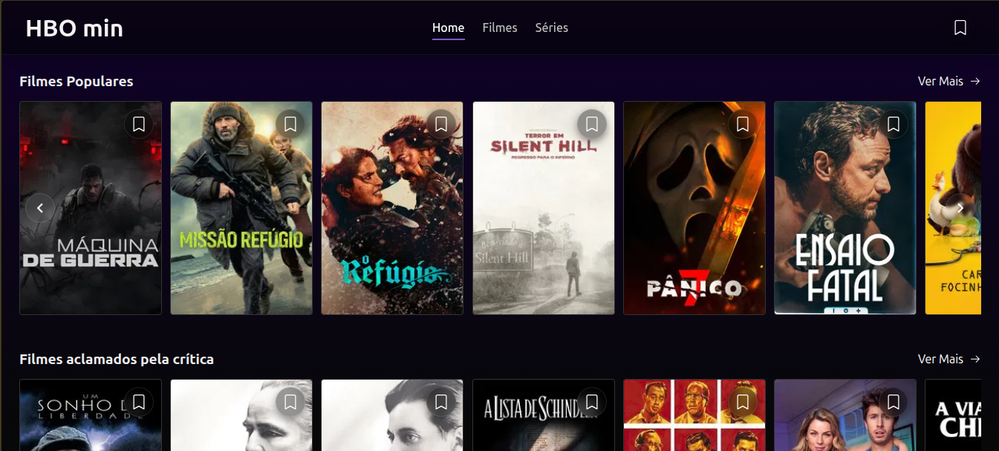
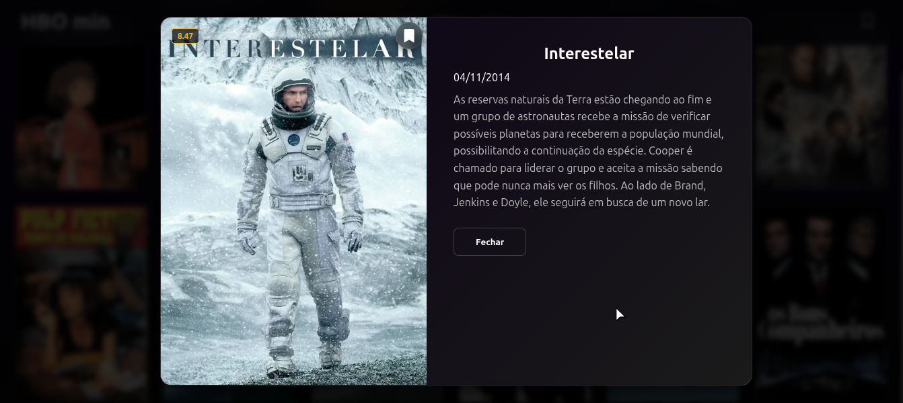

# HBO min 🎬

Um projeto Front-end desenvolvido para aprimorar habilidades em **React** e **TypeScript**, inspirado no design e na experiência de usuário da plataforma HBO Max.

A aplicação consome o catálogo de filmes da API do TMDB (The Movie Database) e permite aos usuários visualizar detalhes das obras e salvar seus filmes favoritos para assistir posteriormente, utilizando armazenamento local.

## Prévia do Projeto

<div align="center">
  
  

</div>

## 🚀 Tecnologias e Ferramentas

- **React 19** - Biblioteca para criação de interfaces de usuário.
- **TypeScript** - Superset do JavaScript que adiciona tipagem estática, trazendo segurança e previsibilidade ao código.
- **Vite** - Ferramenta de build super rápida.
- **TanStack React Query** - Gerenciamento de estado assíncrono e cache das requisições.
- **Axios** - Cliente HTTP para consumo da API.
- **React Router v7** - Gerenciamento de rotas e navegação.
- **React Icons** - Ícones da interface.

## 📁 Arquitetura do Projeto

O projeto foi estruturado visando escalabilidade e separação de responsabilidades:

- `src/components/`: Componentes visuais reutilizáveis.
- `src/pages/`: Páginas da aplicação.
- `src/services/`: Configurações do Axios e chamadas à API do TMDB.
- `src/hooks/`: Hooks customizados (incluindo lógicas do React Query).
- `src/types/`: Definições de interfaces e tipos do TypeScript.
- `src/context/` & `provider/`: Gerenciamento de estados globais.
- `src/utils/`: Funções auxiliares gerais.

## 🧠 Aprendizados e Desafios

Este foi meu **primeiro projeto utilizando TypeScript**. A experiência destacou a importância de um código seguro e auto-documentado.
O principal desafio foi analisar e tipar corretamente os objetos complexos retornados pelas respostas da API do TMDB. Superar esse desafio me trouxe uma compreensão muito mais profunda sobre a integração do TypeScript com o ecossistema React, facilitando a passagem de `props` e evitando erros em tempo de execução.

## 🛠️ Como rodar o projeto localmente

Siga as instruções abaixo para executar o projeto na sua máquina:

1. **Clone este repositório:**

```bash
git clone https://github.com/rafaeltenorioo/my-movies-ts.git
```

2. **Acesse a pasta do projeto:**

```bash
cd my-movies-ts
```

3. **Instale as dependências:**

```bash
npm install
```

4. **Configure as variáveis de ambiente:**

- Crie um arquivo chamado `.env` na raiz do projeto.
- Insira a sua chave de API do TMDB no arquivo:

```env
VITE_TMDB_API_KEY=sua_chave_aqui
```

5. **Inicie o servidor de desenvolvimento:**

```bash
npm run dev
```

🔜 Próximos Passos
A aplicação está em contínuo desenvolvimento. As próximas implementações incluirão:

[ ] Configuração e implementação de testes unitários com Vitest.

[ ] Sistema de "Like/Gostei" para filmes já assistidos.

[ ] Funcionalidade para o usuário adicionar comentários ou reviews pessoais aos filmes já assistidos.
